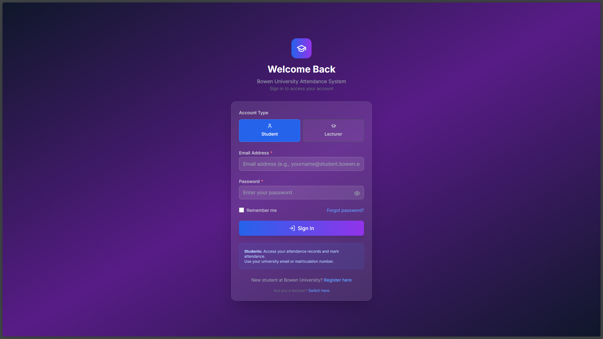

# Facial Recognition Attendance System

A modern, AI-powered attendance management system with facial recognition capabilities, built with React.js and Python.




## 🌟 Features

### Frontend (React.js + Tailwind CSS)

- **Modern UI/UX**: Glass morphism design with dark theme
- **Facial Recognition**: Real-time face detection and recognition for attendance
- **Dashboard Analytics**: Comprehensive attendance analytics and insights
- **User Management**: Profile management with photo upload
- **Responsive Design**: Mobile-first approach, works on all devices
- **Real-time Updates**: Live attendance tracking and notifications

### Backend (Python)

- **Face Recognition**: Advanced face detection using OpenCV and FaceNet
- **Machine Learning**: SVM model for face classification
- **REST API**: Complete API for frontend integration
- **Database**: SQLite/PostgreSQL for data storage
- **Authentication**: JWT-based secure authentication

## 🚀 Quick Start

### Prerequisites

- Node.js 16+ and npm/yarn
- Python 3.8+
- Git

### Frontend Setup

1. **Clone the repository**

```bash
git clone https://github.com/yourusername/facial-recognition-attendance.git
cd facial-recognition-attendance/frontend
```

2. **Install dependencies**

```bash
npm install
# or
yarn install
```

3. **Environment configuration**

```bash
cp .env.example .env
# Edit .env with your configuration
```

4. **Start development server**

```bash
npm start
# or
yarn start
```

The frontend will be available at `http://localhost:3000`

### Backend Setup

1. **Navigate to backend directory**

```bash
cd ../backend
```

2. **Create virtual environment**

```bash
python -m venv venv
source venv/bin/activate  # On Windows: venv\Scripts\activate
```

3. **Install Python dependencies**

```bash
pip install -r requirements.txt
```

4. **Run the existing face recognition system**

```bash
python main.py
```

5. **Set up API server** (create new API endpoints)

```bash
python api/app.py
```

## 🛠️ Technology Stack

### Frontend

- **React 18**: Modern React with hooks and context
- **Tailwind CSS**: Utility-first CSS framework
- **Recharts**: Beautiful, responsive charts
- **Axios**: HTTP client for API calls
- **React Router**: Client-side routing
- **Framer Motion**: Smooth animations
- **React Hot Toast**: Elegant notifications

### Backend

- **Python**: Core language
- **OpenCV**: Computer vision library
- **TensorFlow/Keras**: Machine learning framework
- **FaceNet**: Face recognition model
- **Scikit-learn**: SVM classifier
- **Flask/FastAPI**: Web framework (for API)
- **SQLite/PostgreSQL**: Database

## 📋 API Endpoints

### Authentication

- `POST /api/auth/login` - User login
- `POST /api/auth/register` - User registration
- `GET /api/auth/me` - Get current user
- `PUT /api/auth/profile` - Update profile
- `POST /api/auth/logout` - User logout

### Attendance

- `GET /api/attendance/today` - Get today's attendance
- `POST /api/attendance/check-in` - Face recognition check-in
- `POST /api/attendance/check-out` - Face recognition check-out
- `GET /api/attendance/history` - Get attendance history
- `GET /api/attendance/analytics` - Get attendance analytics

## 🔧 Configuration

### Frontend Environment Variables

```env
REACT_APP_API_URL=http://localhost:8000/api
REACT_APP_WEBSOCKET_URL=ws://localhost:8000/ws
REACT_APP_ENABLE_FACE_RECOGNITION=true
REACT_APP_MOCK_API=true
```

### Backend Configuration

```python
# API Configuration
API_HOST = "localhost"
API_PORT = 8000
DEBUG = True

# Face Recognition Settings
FACE_CONFIDENCE_THRESHOLD = 0.8
MODEL_PATH = "svm_model_160x160.pkl"
EMBEDDINGS_PATH = "faces_embeddings_done_35classes.npz"
```

## 📊 Features Overview

### 🎯 Dashboard

- Real-time attendance status
- Weekly and monthly statistics
- Interactive charts and graphs
- Recent activity timeline
- Quick check-in/check-out buttons

### 👤 Profile Management

- Personal information editing
- Profile photo upload with preview
- Password change functionality
- Account settings and preferences

### 📈 Analytics

- Attendance patterns and trends
- Performance metrics and KPIs
- Goal tracking and achievements
- Detailed statistics and insights

### 📅 Attendance Management

- Complete attendance history
- Manual entry with reason
- Leave request system
- Export functionality (CSV)
- Advanced filtering options

### 🔐 Security Features

- JWT token authentication
- Protected routes and API endpoints
- Input validation and sanitization
- CORS configuration
- Rate limiting

## 🚀 Deployment

### Frontend (Vercel/Netlify)

```bash
npm run build
# Deploy the build folder
```

### Backend (Railway/Heroku)

```bash
# Create Procfile
echo "web: python api/app.py" > Procfile
# Configure environment variables
# Deploy to your preferred platform
```

### Docker Deployment

```bash
docker-compose up --build
```

## 🤝 Contributing

1. Fork the repository
2. Create a feature branch (`git checkout -b feature/amazing-feature`)
3. Commit your changes (`git commit -m 'Add amazing feature'`)
4. Push to the branch (`git push origin feature/amazing-feature`)
5. Open a Pull Request

## 📄 License

This project is licensed under the MIT License - see the [LICENSE](LICENSE) file for details.
